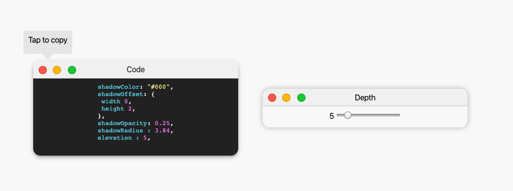

<h4 align="center"> 
	🚀 React Native Shadow Generator 🚀
</h4>

  

  
	
  

  

  
  

  <a href="#-project">Project</a>
  &nbsp;&nbsp;&nbsp;|&nbsp;&nbsp;&nbsp;
  <a href="#rocket-Technologies">Technologies</a>
  &nbsp;&nbsp;&nbsp;|&nbsp;&nbsp;&nbsp;
  <a href="#-how-to-contribute">How to contribute</a>
  &nbsp;&nbsp;&nbsp;|&nbsp;&nbsp;&nbsp;
  <a href="#memo-license">License</a>

## 💻 Project

based on [https://ethercreative.github.io/react-native-shadow-generator/](https://ethercreative.github.io/react-native-shadow-generator/) project

Because I'm lazy and doing it in react native is boring, see [here!](https://godrix.github.io/react-native-shadow-generator/)

<h1 align="center">
    
</h1>

## :rocket: Technologies

This project was developed with the following technologies:

- [HTML5](https://developer.mozilla.org/en-US/docs/Web/Guide/HTML/HTML5) 
- [CSS3](https://developer.mozilla.org/pt-BR/docs/Web/CSS)
- [JavaScript](https://developer.mozilla.org/pt-BR/docs/Web/JavaScript)

## 🤝 Contributing

Contributions, issues and feature requests are welcome! Feel free to check [issues page](https://github.com/godrix/react-native-shadow-generator/issues).
- Make a fork;
- Create a branck with your feature: `git checkout -b my-feature`;
- Commit changes: `git commit -m 'feat: My new feature'`;
- Make a push to your branch: `git push origin my-feature`.

After merging your receipt request to done, you can delete a branch from yours.

## Show your support

Give a ⭐️ if this project helped you!

## :memo: License

This project is under the MIT license. See the [LICENSE](LICENSE.md) for details.

---

Made with ♥ by Godrix :wave: [Get in touch!](https://www.linkedin.com/in/carlosgodri/)